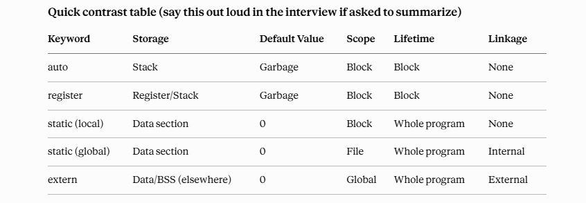
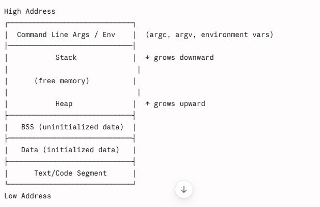

### Bitwise Operations Algos

1) Set a bit position in a given input number 
num = num | 1 << position

2) Clear a bit position in given input number 
num = num & (~(1<<position))

3) Complement / Toggle bit in a given number 
num = num ^ 1<<position

4) To know if a number is power of 2
r = num & (num-1)
If output of this operation is zero, then the number is power of 2.
If output is non-zero, then the number is not power  of 2.

5) To know if in a given number, a given bit position is set or clear.
r = num >> pos & 1
This will give output as either 0 or 1.

6) To know if a number is odd
r = num & 1
If output is 1, number is odd. Else it is even .

7) To know if a number is even.
r = num % 2
if r is 0, number is even, else it is odd.

### Ternary Operator
op1 ? op2 : op3

Code Optimization can be done by compiler to either save the memory or to run the program faster.

Code optimization can be avoided by using volatile keyword. 

In C, type qualifiers are keywords that modify the properties of a type. The main ones are:

1) const

Value cannot be modified after initialization.
Example: const int x = 10;


2) volatile

Tells the compiler that the value may change unexpectedly outside normal program flow.
Common for hardware registers and shared memory.
Example: volatile int sensor;

3) restrict

Available in C99.
Tells the compiler that a pointer is the only way to access that memory in the current scope.
Used mainly for optimization.
Example : void func(int *restrict a, int *restrict b);

4) _Atomic

C11 keyword for atomic operations.
Used for thread-safe access to variables.
Example : _Atomic int counter;

Always remember :
Size of character datatype = 1 Byte
Size of character variable = 1 Byte
Size of character constant = 4 Byte


#### Storage Classes in C

A storage class defines scope, lifetime, default initial value, linkage, and memory location of a variable.

## 1) Auto
Default for local variables inside a function.
Storage: Stack.
Lifetime: Until the block/function exits.
Scope: Local to the block.
Default value: Garbage (uninitialized).
Rarely typed explicitly — it's implicit.

## 2) Register
register
Hint to compiler to keep variable in a CPU register for faster access.
Storage: CPU register (if available), else stack (compiler decides — this is just a request, not a guarantee).
Lifetime: Function scope.
Cannot take address of a register variable (&x invalid) since it may not have a memory address.
Embedded relevance: In tight ISR loops or performance-critical code, but modern compilers (-O2) auto-optimize this anyway; register keyword is largely a legacy hint now.

## 3) Static
static

Two distinct behaviors depending on context — this is a favorite interview trap:

a) Static local variable

Declared inside a function.
Storage: Data section (not stack).
Lifetime: Entire program lifetime (persists across function calls).
Scope: Local to function only.
Initialized once, retains value between calls.
Embedded use: counters across ISR calls, state machines, singleton buffers.

b) Static global variable / static function

Storage: Data section.
Linkage: Internal only — restricts visibility to the file it's declared in (not accessible via extern from other files).
Used heavily in embedded to enforce module encapsulation (e.g., a .c file's private helper functions/state not exposed in the header).

## 4) Extern
Declares a variable/function defined in another file (or later in the same file).
Storage: Wherever the actual definition lives (typically data/BSS section for globals).
Linkage: External — makes symbol visible across translation units.
Doesn't allocate memory itself — just a declaration/promise to the linker.
Embedded use: sharing peripheral register handles, global config structs across driver files.


## Quick contrast table (say this out loud in the interview if asked to summarize)


## Memory structure in C



1) Stack

Stores: function call frames — local variables, return addresses, function parameters, saved registers.
Grows downward (high → low address) on most architectures (ARM included).
LIFO — managed automatically by compiler via stack pointer (SP).
Fixed/limited size — stack overflow is a real embedded concern (no OS to catch it gracefully on bare-metal; corrupts adjacent memory silently).
Fast access — just pointer arithmetic.


2) Heap

Dynamic memory: malloc, calloc, realloc, free (C) / new, delete (C++).
Grows upward toward the stack.
Managed manually by programmer (or RTOS heap manager like pvPortMalloc in FreeRTOS).
Embedded relevance — this is a strong talking point: heap usage is often discouraged or banned in safety-critical/automotive embedded systems (MISRA C guidelines) due to:
Fragmentation over long uptimes
Non-deterministic allocation time (bad for real-time/RTOS scheduling)
No formal guarantee of available memory in resource-constrained MCUs
Preference for static/pool allocation instead.

3) Data Section (Initialized Data)

Holds global and static variables that are explicitly initialized with a non-zero value.
Example: static int count = 5;
Stored in the binary's data section, loaded into RAM at startup (in embedded: copied from Flash to RAM by startup/init code, since RAM is volatile).

4) BSS Section (Block Started by Symbol) — subsection of "data"

Holds global/static variables initialized to zero or uninitialized (compiler defaults them to 0).
Example: static int arr[100]; or int global_flag;
Not stored in the binary image itself — just a size marker. Startup code zero-fills this region in RAM at boot (.bss init in the reset handler/startup.s).
Embedded relevance: this is why in your Aptiv/embedded work, .bss size matters for RAM footprint — it's "free" in flash but costs RAM.

5) Text/Code Segment

Holds the actual compiled machine instructions.
Typically read-only (write-protected via MMU/MPU where available) to prevent accidental/malicious code modification.
Also may contain read-only literals/constants (const string literals, jump tables) — sometimes split into a .rodata subsection.
In embedded: this section resides in Flash/ROM, executed either directly (XIP) or copied to RAM (for speed, e.g., on some ARM Cortex-M with RAM-based execution for ISRs).

6) Command-Line Args / Environment section
Topmost region; holds argc, argv[], and environment variables.
Not really relevant on bare-metal embedded targets (no OS/shell invoking main() with args) — good to mention this distinction shows you understand embedded vs. hosted environments. On embedded, main() typically has no meaningful argc/argv; startup code just jumps to main() after .data/.bss init.

 ## Good one-liner for the interview: "Flash holds the persistent image — code, rodata, and the initial values for .data. At reset, the startup code copies .data's init values from Flash into RAM and zero-fills .bss in RAM, then jumps to main(). Code itself typically stays in Flash and executes in place, unless the target copies it to RAM for speed."

 
 
## `char *` Array — `sizeof`, Dereferencing & Array-to-Pointer Decay

Example :

```c
char *str[] = {
    "hdhshsh",
    "hdhdhsh",
    "yetaet"
};

str is an array of 3 pointers to char, NOT a pointer itself.

str
 │
 ├── str[0] ──→ "hdhshsh"
 ├── str[1] ──→ "hdhdhsh"
 └── str[2] ──→ "yetaet"

Assuming a 32-bit system, a pointer is 4 bytes.

Type & Size
Expression	Type	Size
str	char *[3] — array of 3 char *	12 bytes
str[0]	char *	4 bytes
*str	char * (str[0])	4 bytes
str[0][0]	char	1 byte
&str	char *(*)[3] — pointer to entire array	4 bytes

sizeof() Results
sizeof(str)       // 12 bytes
sizeof(&str)      // 4 bytes
sizeof(*str)      // 4 bytes
sizeof(str[0])    // 4 bytes
sizeof(str[0][0]) // 1 byte
Why is sizeof(str) 12 and not 4?

Although an array usually decays to a pointer in expressions, sizeof is an important exception.

sizeof(str)

operates on the actual array, so:

3 elements × 4 bytes per char pointer
= 12 bytes

Therefore:

str → array of 3 char* → 12 bytes
Why is sizeof(*str) 4?

*str refers to the first element:

*str == str[0]

And str[0] is a char *.

Therefore:

sizeof(*str)
= sizeof(str[0])
= sizeof(char *)
= 4 bytes
Why is sizeof(&str) 4?

&str means address of the entire array.

Its type is:

char *(*)[3]

This is a pointer to an array of 3 char *.

Since it is a pointer:

sizeof(&str) = 4 bytes
Important Distinction
char *str[3];

means:

str → ARRAY of 3 char pointers

whereas:

char **p;

means:

p → POINTER to char pointer

For example:

char *str[3];
char **p = str;

sizeof(str);    // 12 bytes
sizeof(p);      // 4 bytes
Array-to-Pointer Decay

An array generally decays into a pointer to its first element:

char **p = str;

Here:

str → &str[0]

However, this decay does not happen with sizeof(str).

Function Parameter Trap

An array parameter is adjusted to a pointer:

void func(char *str[])
{
    printf("%zu\n", sizeof(str));
}

Inside the function, str is effectively:

char **str;

Therefore, on a 32-bit system:

sizeof(str)   // 4 bytes

Even if the original array had 3 elements.

Interview Takeaway

Remember these three:

sizeof(str)    // 12 → entire array
sizeof(*str)   // 4  → first element (char *)
sizeof(&str)   // 4  → pointer to entire array

Key Rule:

sizeof(array) → size of the entire array
sizeof(*array) → size of one element
sizeof(&array) → size of a pointer to the array