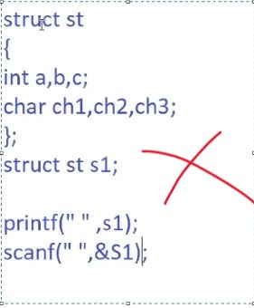

###### open this file with markdown enhanced preview extension in VS Code

# C vs C++

| Sr no | C | C++ |
| - |---- | ---- |
| 1 | Printf & Scanf are functions in C | Cout & Cin are objects of class in C++ |
| 2 | Printf & Scanf require format specifiers | But Cout & Cin do not require format specifiers |
| 3 | You can't print user defined datatypes like structure in C directly | Opposite can be done in C++ using operator overloading |

#### Example of point 3
##### 3.1 w.r.t C
Given below can't be done in C. That means, you can't directly take input of a struture or print a structure in C. You have to access individual elements of that structure by s1.a , s1.b ...etc.
 

##### 3.2  w.r.t C++
Whereas in C++ you can directly write 
Cin>>S1;
or
Cout<<S1;

### Function Overloading
Function Overloading refers to capability of using same named Functions to perform several different tasks. 
Name for the functions can be same, However these functions must differ in the number of arguments , order of arguments or types of arguments.
 

##### NAMEMANGLING : 
Compiler will internally change the function name for its reference on the basis of number of Args, datatype or order of arguments to differentiate between same function names. This concept is called NAMEMANGLING.
To see the function namemangling opertion, you can refer to the translator stage program of out file by using following command :
g++ -S filename -o 36.s
After compiling your file using above command, one .s file will be generated for your file. It is the compile time file for your source code. You can see the namemangling for functions in that file.

###### Compilation stages & Generating stage wise file
Please find below image for referring the file generation as per Compilation stages.

###### C Structure v/s C++ Structure

In a Class, by default all members are private , and can be accessed only by member functions.

###### Access Specifiers in C++
Accessibility to class's data members when access specifiers are made use of.

###### Refer 40.cc in repo for "This Pointer" 
To see the this ptr operation on a program/file you can use following commands with flags as mentioned:
g++ filename.cpp -fdump -tree-gimple
then a new file will be created by the name of 
"filename.cpp.006t.gimple" 
In this file you can see the operation of this ptr.

###### Friend Functions in C++
Friend function is a non-member function that can access private/protected data of a class.

###### Friend Class v/s Friend Function

###### Constructors
C++ provides a mechanism to initialize an object during its creation and destroy the object when its no longer needed by
using special member functions called _Constructors & Destructors_.
**Constructor** is a special member function of a class which is invoked automatically when an object of same class is created.
The Object gets automatically initialized by the constructor.

Whenever an object is created, the constructor is invoked automatically. Therefore a stack frame will be created for constructor. after that program will return to main & call print_data(); function. further stack frame for print_Data will be created.
Constructor can only be in public section. Not in private as otherwise other functions won't be able to access the constructor.

Successfull object creation happens only when:
1)memory is created for the object[Os creates memory]
2)Memory is initialized for the object[This is done by constructor.]
This proves that constructor is called before object creation.

**Types of Constructors**
1) Default constructor : You need not pass any argument to the constructor. Default arguments will be passed by the compiler.
If user provides constructor explicitly then compiler will not provide any default constructor.

2) Parameterized constructor : You send some parameter through object, while creating the object.
3) Copy constructor

**Drawback of Shallow Copy:**

**Refer 64.cc**
Now in above code, when s1 is created parameterized constructor is called , Dynamic memory is allocated & pointer 'name' will point to that Dynamic Memory where further the string passed by object is stored.
But now when you create s2 & pass s1, so for 's2' no specific Copy Constructor is explicitly defined by user so "Shallow Copy" called. for s2 aswell name pointer is present which will point at the same dynamically allocated memory of S1.
Therefore now both name ptrs of S1 & S2 are pointing at same Dynamic memory location. If any of the one is updated, then it will reflect/update in the another aswell.
You can see that when we modify s1 through modify data function, that modification is reflecting in both s1 & s2 later at line 38 , 39.
**Benefit of Deep Copy:**

**Refer 65.cc**

**Benefit of Deep Copy over Shallow** 
Now in above code, when s1 is created parameterized constructor is called , Dynamic memory is allocated & pointer 'name' will point to that Dynamic Memory where further the string passed by object is stored.
Now when you create s2 & pass s1, so for 's2' specific Copy Constructor which is explicitly defined by user for "Deep Copy" is called. S2 will be sending S1 
& S1 is taken as reference in the deep copy Constructor. for s2 in the deep copy constructor a new Dynamic Memory allocation will be done in the Copy Costructor which will be having different address from s1. So changing the value at s1's name won't affect s2.
**Why Copy Constructor takes arguments as Reference**

**Issue faced if Copy Constructor won't take input as reference (Leads to Segementation Fault)**

**Constructor & Destructors won't be invoked in case of pointers creation. 
They are only invoked for objects Creation.**
**Destructors**

Destructors are special member functions of a class which are invoked for destroying an Object at the end of program.

**By default member functions provided to a Class are:**
1) Default constructor
2) Default destructor
3) Copy Constructor
4) Assignment Operator Overloaded Function.

**Constant Member Function**
It is a member function where the data members are constant.

**Static Data Member & Static Member Functions**
*Refer Static_DataMembers_and_Static_MemberFunctions Module for codes on this topic* 

###### Operator Overloading
Operator Overloading works on predefined aswell as userdefined datatypes.

**Syntax of writing Operator Overloaded Friend Function for extraction & insertion operator**

The below mentioned operators already work on user-defined datatype. Basically Operator Overloading is done in case of those operators who can only work on predefined datatypes. So for them you overload the operators so that they can also
work with userdefined datatypes.

*For 80.cc refer below code*

**Operator Overloading non-member friend function(Refer 82.cc)**

# Inheritance

# Types of Inheritance
##### Multiple Inheritance

##### Hybrid Inheritance

##### Hierarchial Inheritance

##### Multipath Inheritance

### File Revision History 
| Rev | Date | Name |
| --- | --- | --- | 
| 1.0 | 27-Feb-2024 | Manas |
| 2.0 | 07-Apr-2024 | Manas |
| 3.0 | 05-May-2024 | Manas |