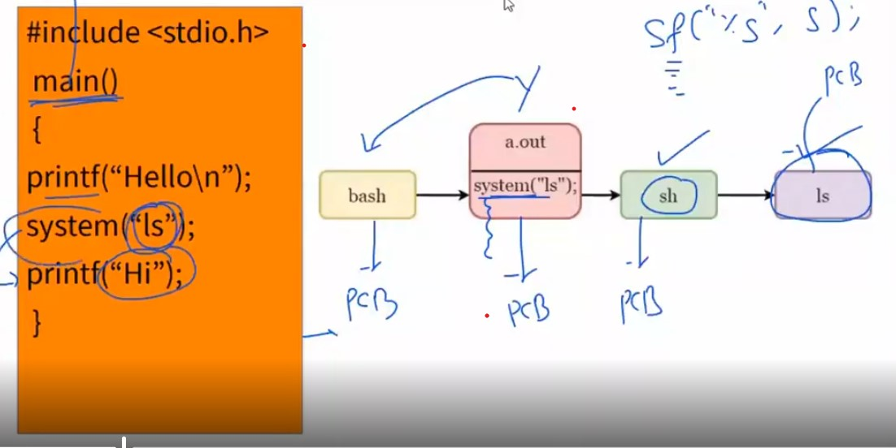
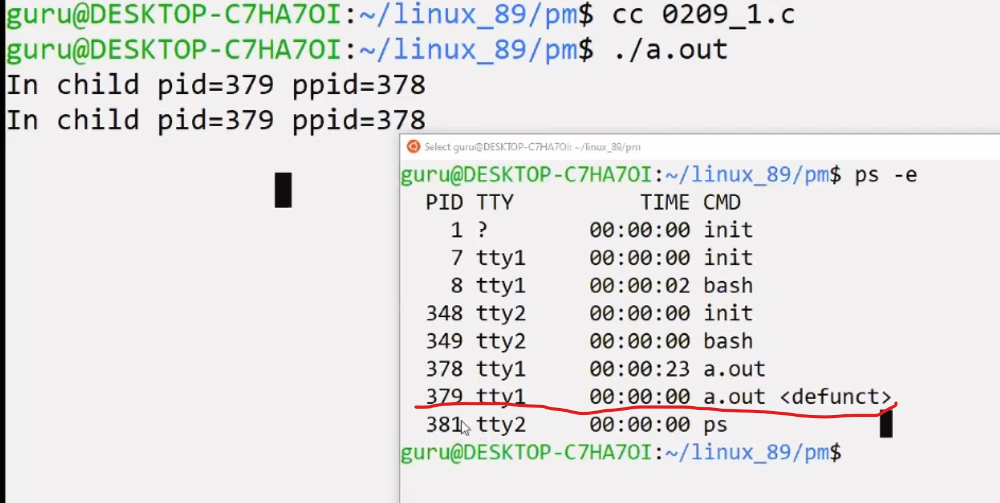
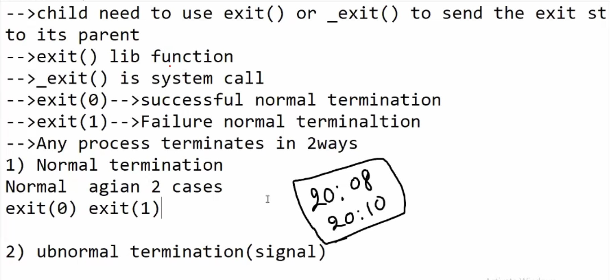
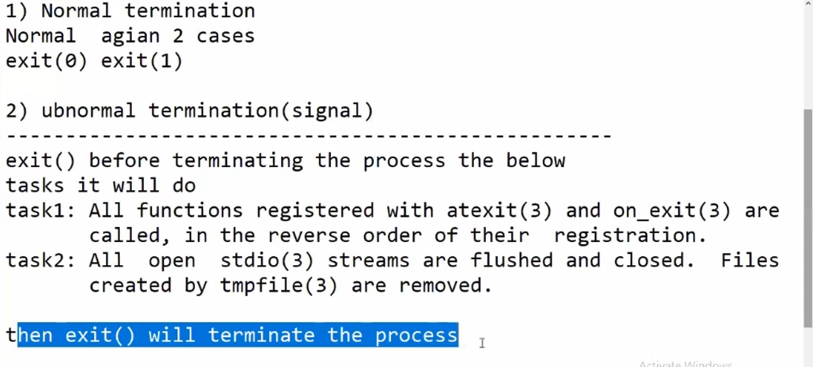
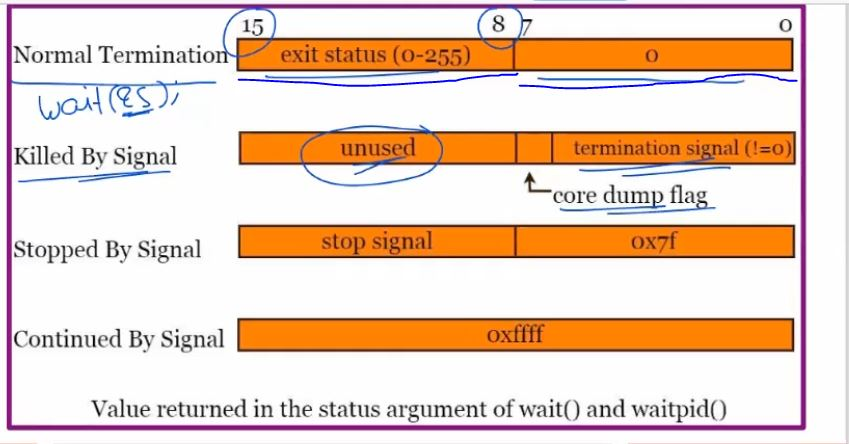
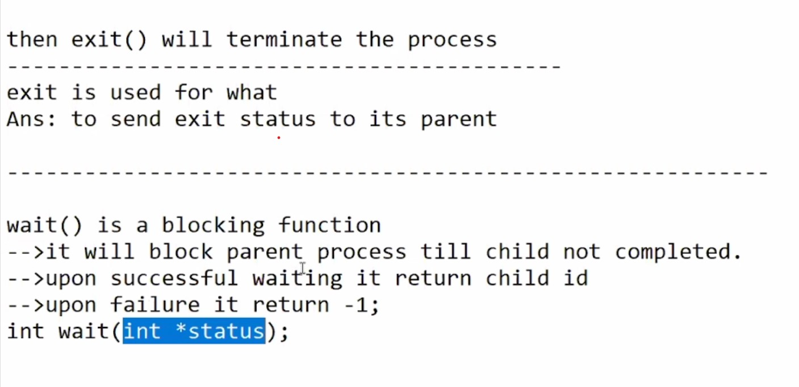
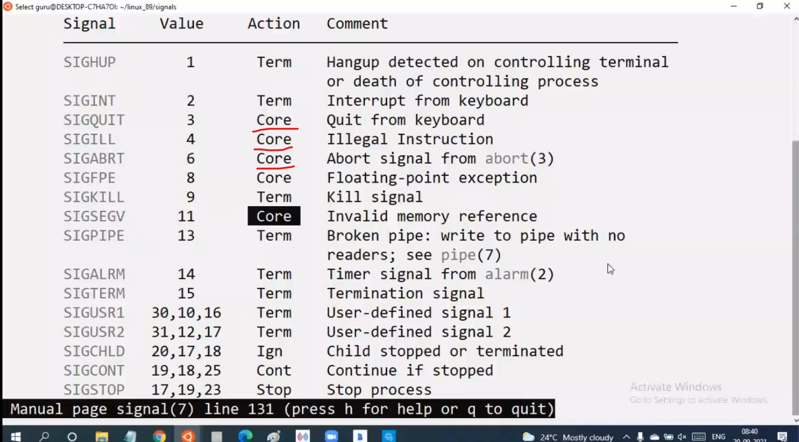
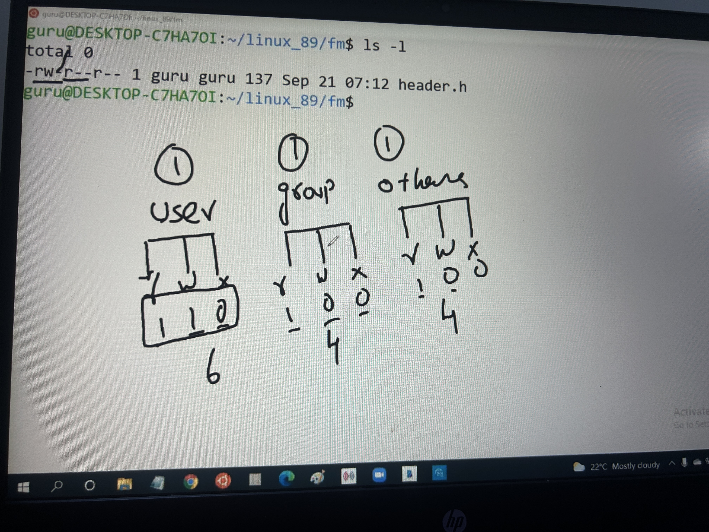
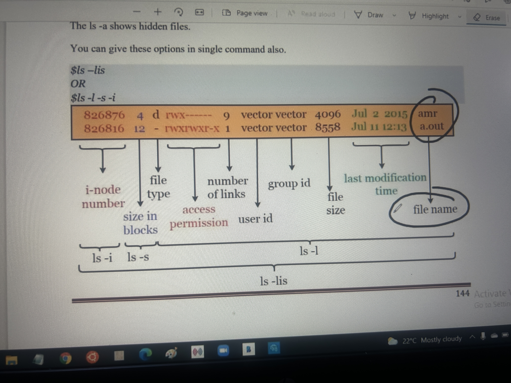

###### open this file with markdown enhanced preview extension in VS Code

# In this file I shall be sharing all Linux based commands & some OS level concepts

Predefined functions are the compiler supported functions, also called Library functions.
Predefined function declarations are present in header files , definitions are present in Library.

Compilation stages : 
1) Preprocessor 
2) Translator
3) Assembler - After assembler you get the .o file, that is object file. This is what you call the Library file containing all      predefined function definitions
4) Linker - Links the libraries and generated executible files.

Library is a place where all function definitions are kept together, in form of object file. It is an already compiled code which can be used by anyone without exposing the actual source code behind the library.
Library linking part comes at the Linker stage.

##### Types of Library : 
1) Static Library - helps Static Linking (It is also called as archive file, .a file) ex: libc.a, libm.a 
2) Dynamic Library - helps in Dynamic Load time & Dynamic Runtime Linking (Also called shared object .so or dll file) ex: libc.so , libm.so

If linker is Linking with static library, it will add all the necessary function definitions in the a.out/exe file.
If Linker is linking with dynamic library , it will not copy the function definitions. It will copy only the references.

Hence size of executible file is more in static library compared to dynamic.

##### Default Linking :
If you compile a program using this command ->  cc filename.c 
By default linker links with 3 libraries. Two of them are OS related libraries, third one is libc.so
libc.so contains all   predefined function definitions like printf , scanf , etc.

##### Creating Library
Remember that while creating Libraries , you should not add main function definition inside the library.
Main function definition is only supposed to be in the source code file.
To create the library , we need to create .o files from .c files.
Using command:
    gcc -c filename.c -o filename.o

## Importants commands (Most of these commands will only work in Linux based systems) :

1) cc filename.c -o "executible_filename"  --> This command generates an executible file with the name we have provided. 
In this case default linker links with dynamic C library.

2) cc -static filname.c -o "executible_filename" --> Static  Linking

3) size filename  --> Tells different memory size occupied by file (Data/Code/Bss)

4) ldd filename  --> Displays list of dependency files, the executible file required while executing.

5) nm filename > temp    --> This is called output redirection. Output of file will be stored in temp.
By opening temp file we can see which all function definitions have been linked with our main file.

6) gcc -c filename.c -o filename.o   --> '-c' means you are asking compiler to stop compilation after assembler.  
    filename.o is an object file which will be created using above command. In above command,'-o filename.o' is optional.

7) ar -rcsv libabc.a sum.o mul.o print.o   --> libabc.a is the name of the static  library you want to create , in which you will be putting the 3 .o files.
   
   meaning of command : archive file creation ( That is static library) 
                        r c s v ,
                        r = replace objects in already present library with the new once provided in command line.
                        c = do not warn if library is newly created
                        s = tells ar to create a symbol table, gcc needs this table when we are using the library
                        v = verbose mode , tells ar to keep you informed about what it's doing.

8) ar -t libabc.a     --> Displays what all object files were used into creation of library

9) ar -r libabc.a sum.o  --> If you want to replace sum.o object file in the library libabc.a

10) cc -c -fpic filename.c  --> Command to create .o files from .c files to fill into dynamic library. (fpic stands for "position independent code")

11) Command to create a dynamic Library out of the .o files  mentioned above.
    -->    cc  -shared  -o  libmno.so  sum.o  mul.o  print.o
    Therefore , libmno.so is a dynamic library made out of sum mul and print.o

12) ps -e  -->  ps means process list, -e means all the terminals which are open right now, l means long list.

13) Signal 19 to suspend the process , 18 to resume the process, 9 to terminate the process forcefully.

Topics that we will be studying going ahead :

- Process and process management
- Signal Handling
- File and File Management
- Process Synchronization using Semaphore 
- Threads and Multi-threading
- Memory Management

Operating System :

An operating system consists of two parts , applications and kernel.
Applications and Kernel are combinedly called as OS. Kernel consists of services and managers like network manager/memory manager/hardware manager, etc ... 
Kernel is backbone of operating system and should mandatorily be there for seamless operation of application. 

Booting steps of Linux Operating System :

BIOS
MBR
GRUB
Kernel

1) BIOS 
Basic Input/Output System.

Performs system integrity check (ex : sometimes on turning onn CPU , you will get blue screen BIOS error. It does a quick check of basic input output peripherals, like RAM, ROM, Hardisk, Motherboard.)
BIOS is usually return in Assembly (Low level program) example companies - American Megatrends (AMI).
So BIOS will check all these essential hardwares required for loading the Bootloader program and if any issue is found in the process, blue screen BIOS error will appear.

In BIOS you can change, from where the operating system is supposed to be fetched - from bootable pendrive/ from CD/ From network., etc
Can also change the boot sequence by updating 1st/2nd bootable priorities.

Bootloader Program is loaded in the ROM chip by Motherboard or Controller Manufacturer

2) MBR 
Master Boot Record - located in first sector of hardisk.

BIOS program further initiates MBR. 
MBR is less than 512 bytes in size. 
MBR contains information about GRUB.
MBR is one file/list present in starting sector of your bootable device. In that starting sector GRUB is stored.

3) GRUB - Grand Unified Bootloader 
GRUB is a type of Bootloader. 

LILO is Linux Operating System's Bootloader. 
Similar to GRUB, Windows OS has NTLoader as its Bootloader.
Using GRUB you can load LINUX as well as WINDOWS.
Example, in lab systems you have dual booting options for both windows and linux/ubuntu.
If you have multiple kernel images installed on your system, you can choose the kernel which is to be executed. 
A default kernel needs to be set in case no specific kernel is selected by user while booting. 
This flexibility is provided to use by GRUB.
So task of GRUB is to load kernel into the RAM for execution.

4) Kernel 
Kernel is core of the Operating system.

In simple words loading a kernel basically means, loading the OS in the RAM. Similar to how application image file is loaded in ram once radar is booted in office.
In Linux, after kernel is loaded, it executed a program called "init" present in sbin folder of Linux OS.
In Windows, this program is found in C drive. 

Types of Files system :

Linux File systems -
- Ext2 file system
- Ext3 file system

Windows File system -
- FAT file system
- NTFS file system (Pendrive/Local Disk file systems)

So In step 4, first File system is mounted, 
then kernel gets loaded that is all managers are loaded.
Then kernel executes a program called init program.

Init program path in Linux -  /sbin/init_program
Init program path in Windows -  /C_drive/init_program

RAM space is divided in two parts - 
Kernel Space and User Space

Kernel space stores all managers. 
User space consists of our application and Programs 

So once file system is loaded in step 4, first program to run in user space is called init program or init process.

Entities that run in User space are called as processes.
Entities that run in Kernel space is called as services.

5) Init 
Init program is run by Kernel. Init executes run level programs. Such as different services - memory services, network services, etc.

6) Run level programs 
Runlevel programs are executed from /etc/rc.d/rc*

### Random Number Generation 

Header file needed for Rand function is <stdlib.h>.
Functions involved are Rand & Srand function.
These are predefined functions for which there are dedicated MAN pages. You should make habit of reading MAN pages.

- rand() function : This function generates random numnber between 0 and RAND_MAX (as per MAN page of RAND())
                    but the sequence of numbers it generates are usually of same sequence.

We use Srand function if we want to get random numbers.                    
- srand() function : This function generates random number based on a seed provided.

All these details can be seen in MAN page of these functions/stdlib.h.

Modulus operator (%)
It is basically the remainder calculating operator.

Example: 

Dividend = Divisor x Quotient + Remainder

Therefore, if 15 is divided by 2, Remainder = 1.
So, 15 % 2 = 1.

- X % Y is always in the range of 0 to Y-1.
ex: 
        X % 10 -> values from 0 to 9
        X % 100 -> Values from 0 to 99
        X % 51 -> Values from 0 to 50

This property is the key reason , modulus operators are used to generate random numbers.

If you want the range that does not start at 0, you can consider adding offset in the random number generation algorithm.
Example : 
            rand() % 100 + 50  
            Generates numbers in the range of 50 to 150.

#### Types of Linkings during compilation and execution of program :

Static/Compile time linking, Load time linking & Run time linking

Dynamic Runtime Linking:

Functions involved to implement dynamic runtime linking:

dlopen(): used for opening the lib and loading it into RAM. -> hdr file to include is <dlfcn.h>
          dlopen returns library start address, and 0 upon failure.

dlsym(): used for getting function address.
dlclose(): unloading lib from RAM to HDrive.
dlerror(): display proper error msg.

#### What is process ?
Whenever a file is compiled, an executable is created and is stored in Flash/ROM. When in Flash, this file has code and data section by default. When we run this executable, a copy/image of it is loaded into RAM, remember that a copy of executable is loaded without deleting the original one from Flash. When loaded into RAM, apart from code and data, even Heap and Stack section is created. Whenever an executable is loaded into RAM for execution , that becomes a *Process*.

Definition: Any file capable of getting executed is called program. Any program that can be loaded into RAM for execution is called Process.

Points to note :
- Size of executable file and process are different. Because executable file has only Data and Code section whereas process has Data, Code, Stack aswell as Heap section.

Types of Process Execution : Concurrent and Sequential process executions.

Process Manager : Manages execution of processes by CPU, because only 1 CPU but multiple processes. So Process manager manages seamless switching and execution by using a Single CPU Resource.

#### Multiprocessing 
Multiple applications running at the same time is called Multiprocessing. 
Types :
Hardware and Software Multiprocessing

##### Hardware Multiprocessing 
Every application has individual CPUs. Basically the system will be having more than one CPUs. 

##### Software Multiprocessing 
Single CPU handles multiple processes by process manager based programming.

#### Foreground and Background processes 

Foreground process : When we simply do a.exe or ./a.out for running the executible, we see something running in the bash as per the code. This is foreground process running. 

Background process : If you want to run a process in background , command -  " ./a.out & ".
After running this command , you will observe 2 numbers printed on screen. First represents "Job ID" , second represents "Process ID".

"ls" command tells us number of files present in the directory.

"ls -l" Long list

"ps" command lists the processes running in current terminal.

"ps -e" list of processes in system.

"ps -l" long list of processes in current terminal.

"fg" to move the background processes into foreground.

"size" this command displays size of object file or executible.

Ideally to kill/close the processes, you need to bring them to foreground. This can be done using fg command. This works on Stack principle.
That is , last in first out. Last process that goes in pops out first when we give fg command. 

If you want to kill the process without bringing it into foreground, you can use command - 

 kill -9 "process ID"

 example -  kill -9 6215 

 ### Process and Process Management

Init program has process ID of 1.

 Bash is a Shell. Shell is a command interpreter.
 Shell is a program used to interact with OS.

 Examples of shell : sh, bash, ksh, etc

 Flow of Communication :

 User -> Command Interpreter/Shell -> Kernel -> Hardware

 Important Definitions :

 Response Time : The time gap between the process loaded into RAM and its first instruction executed by the CPU.

 Starvation time : The time that a process underwent due to starvation for execution as the CPU could not attend it , is called starvation time.

 Turnaround time : Time gap between process loaded into RAM and its execution completed.

 Throughput : Number of processes completed per unit time

Lec-10 : To understand how a process switches between Ready/Run/Wait state, at times in the same program.
Check processes_1.c file for the same.

Every process has its own stack(8 mb), data and code section. If one process tries accessing another process memory, then we get segmentation fault(unauthorized memory access).
For every process, fixed time slot is allotted in case of concurrent execution.

Processes are present in user space. Process manager is present in Kernel space.
Process manager creates PCB (Process Control Block) for every process in Kernel space.

PCB contains following data for every process -
PID, PPID, Program Counter, Stack pointer, Memory limits

Every process has a separate PCB.
Based on the process which is being executed at an instance, CPU registers are loaded with data from PCB. Based on process switching,
from one process to another, loading and unloading of PCB data happens in CPU registers.
Even process manager itself is a process.

This loading and unloading of PCB data into CPU registers from process to process is called as Context Switching.
CPU switches between the processes when the time slice expires or when the timer interrupt comes.

Normally context switching happens after end of the process time slice, but there is possibility the process gets suspended or delayed before the completion of time slice. In that case also context switching happens.

Process Manager is a system level process. Process that process manager handles are user level processes. 
Between every user level process switching (context switching) , system process has to operate.

               

| Sr no | Library Functions   | System Calls |
| - |---- | ---- |
| 1 |   Supported by Compilers | Supported by Operating Systems |
| 2 | Another name is application programming Interface(API) | Another name is System Call Interface(SCI) |
| 3 | Writing program with APIs is called as application programming | Writing programs with SCIs is called System Programming |
| 4 |   Library functions are slower, but process calling library functions execute faster | System calls are faster but process calling system calls execute slower |
| 5 | Lib functions are user friendly, and task specific   | System calls are OS friendly and generic in nature |
| 6 |   Lib functions execute in user space | System calls execute in Kernel Space |

In Linux OS, use command " man man " to see the 9 subcategory divisons of man page.
Library functions internally make system calls.

Based on the categorizatiom shown in "man man", number 2 is for OS level function, 3 is for compiler supported functions.

Command used : man system
This is a compiler supported function which is used to execute a shell command.

Prototype :-
               int system (const char *command);
You can use this function to give command line level instructions through .c code. Such as- ls, ps, etc.

 

System call can also be called a blocking function. If in a code there are 3 system calls in a line, then until and unless the first system call completes, the second won't start and same goes for the third. This is because system calls execute sequentially and nit concurrently.

## You can see prototypes of all functions by typing "man functionname" in linux based system or in google chrome.

#### FORK(2)
FORK is a system call. It creates a new/child process by duplicating the calling process/Parent process.
Necessary header files to include for FORK call in Linux, 
#include <unistd.h>
#include <sys/types.h>

After fork whatever statements are written in program, those will be executed by parent aswell as child.
Very important point is that, parent and child will execute concurrently.
After fork call, total code/stack/heap/data section of the parent process is duplicated and given to child, basically whole program gets duplicated, even the PCB.
But execution in child process initiates only from the point where the fork call was made in parent process.
You can check man page of fork for more knowledge.

Important point to remember : Scheduler or process manager's process  ID is 0.

### Orphan and Zombie process
Concepts of Orphan and Zombie process are related to child process. Lifetimes of Parent and child process may
or may not be the same. 

Orphan process : If parent process execution completed before the child. Then the child process is called Orphan process.
For any Orphan process , init process is the parent.

Zombie Process : If child execution completes , but parent process is still executing, then the child becomes zombie.
Zombie is a dead process which has no instruction left to execute and is left in defunctional state.
 

Zombie processes are created so that parent can get the exit status of child. Once that exit status is collected by parent during its execution, PCB kills the zombie.
But zombie is harmful to RAM as it occupies RAM space even if not executing. So it needs to be handled wisely.

If parent wants to collect the exit status, parent must use wait() or waitpid().

Child sends exit status to parent at the end of program or at the program termination, using the command exit() or _exit().
exit(0) - normal successful termination.
exit(1) - normal failure termination.
_exit(0) - normal successful immediate termination.
exit(0) - normal failure immediate termination.

EXIT_SUCCESS and EXIT_FAILURE are the macros that can be used to send the exit status through exit().
EXIT_SUCCESS is 0.
EXIT_FAILURE is 1.
Refer below image for normal and abnormal termination types.

### Shading some light on significance of the integer variable "S" created in wait_1.c program.
- In case of normal termination, the second byte of the variable will store the exit status.
- whereas in case of abnormal termination, first byte will store the signal value of that abnormal termination.
For more details, refer below image

2
Using atexit() and onexit() functions we can register the functions that are be called in the reverse order of their registration sequence.

#### Wait Function call
Wait is a blocking function. It haults parent execution until child completes.

Some important macros :

Below macro gives you more information on reason behind process termination and if the child process was terminated normally or forcefully/abnormally.

- WIFEXITED(wstatus)
WIFEXITED is an argument based macro which takes wstatus as argument.
This macro returns TRUE if the child process terminated normally, by calling exit(3) or  _exit(2) , or by returning from the main().

You can get more info on above macros in the MAN page.
Refer wait_2.c program of this repo for the same.

##### waitpid() function 
 We need to pass three arguments to the waitpid function.
 prototype : pid_t waitpid(pid, *wstatus,  options).
 wait() that we discussed before , is used to terminate any one of the child.

 Using waitpid() , we can pass specific child process id as argument to the waitpid function call.
 The child process id can be achieved from fork(). Fork() returns child process id.
 example usage :
 waitpid(y+2, &s, 0) ->    parent is waiting for y+2 process to terminate and collect the status.
 waitpid(y+3, &s, 0) ->    parent is waiting for y+3 to terminate and not interested to collect the status.
waitpid(-1, &s, 0) -> If you use first argument as -1, then it will behave as regular wait() function call. That means it will accept any first process ID that completes.
 - Third argument of waitpid()
 Third argument is the options argument.
 Third argument is passed through some application specific bit masking macros.
 
 

 

### Exec_Family_Of_Functions
Exec family of functions are utilised to replace current process image with new process image.
for example, when we use system("ls") call in the program, it acts like a blocking function, wherein it creates a concurrent shell process and in that it will run ls command. so new process ID is created apart from parent process where the system call was made.
Whereas in case if the exec function is used instead of system function call, the new process id image is directly pasted on the ongoing process, so in that case whatever lines are present in the parent code after exec function call will be lost and will be replaced by exec process id code. 
Whereas in case of system function call, code present after system call will also execute.
so exec calls benefit is that creation of new process id is avoided but some code of parent process might get overwritten.

Functions mentioned in above image are variable list argument functions. There are two ways in which you can indicate to the compiler that the arguments being passed to the variable argument list function are completed.
1) Paasing NULL at the end. exaample : execl(arg1, arg2, arg3, ... , NULL);
2) Passing a fixed argument that depicts  number of variable  arguments being sent.

prototype of execl :

execl ("Provide path including name of Executible", "name of the command", "supplying any options for executing the command", "NULL" )

1 - usage example : execl ("bin/ls", "ls", "-l", NULL);

2 - another usage example of execlp : execlp("filename.c", "ls", "-l", NULL);

Ideally, when the 2nd function is used where the "execlp" function tries accessing the filename.
That file can  be accessed either via the path provided in the function argument. If there is no path provided in the function arguments, then the program searches through all the paths provided in the  environemnt variables / Shell variables , to see if the file mentioned in the function arguments is found on any of those paths. 

echo is a shell scripting related keyword that prints data on screen (similar to printf/cout )
$ tells us content at that variable.
PATH is a shell variable which stores certain paths specified by user for Environment variable/Shell variable. 
Therefore , echo $PATH -> prints data stored in variable PATH.

So whenever you supply a command in bash without specific path, bash will go through all the paths provided in PATH variable.

If you simple type ENV , you will get all environment variable keywords.

So if you are not sure about path, use execlp, if know that path, use execl.
If you use execl and provide wrong path , then execl won't execute and original program/process ID will run as it is. New process ID won't get created and so the new process ID won't overwrite on the ongoing process and the line that was present of execl will run as it is. 

Using fork and system call , we had created 6 processes 2 commands. 
using fork and execl apis, we can do that same work in 2 processes 2 commands. (Vector Lec 19 last 20 mins). 
Hence , execl with fork helps reduce processor burden in concurrent processing (unlike fork with system).

One interesting bash trick to execute multiple commands : 
ls;cal;pwd  -> executes all three commands. 
processor does it by creating three child processes and same execl apis.

// Lec-26 onwards ( Lost some data in between in the office laptop) // Somewhere around Lec15 - Lec25 notes and codes were lost in office laptop //

Signal Handling Continued --> 

Signal function disadvantages and Signal function retun type discussed in last lectures. 

1) SIGNAL function
Signal function - signal() , returns the old action and is used to set a new action.
You can go through MAN page of signal function to understand its prototype and operation.

Disadvantage of Signal Function :
1) Without setting new action, we can't know the status of old action.
2) When process is executing ISR, because of some signal, at that time another signal comes, signal manager is immediately delivering other signal to the process even though previous action is not completed. 

TO overcome these disadvantages we can use SIGACTION() in the place of  SIGNAL()
Just like using WAITPID() instead of WAIT()

2) SIGACTION function

prototype : 

int sigaction(int sig, const struct sigaction *act, struct sigaction *oldact);

returns 0 on success , or -1 on error.

We pass three arguments to sigaction(), first argunent is signal number, second and third arguments are address of a structure variable.
Name os structure is also sigaction structure.

Sigaction can be called in three different ways :
a) sigaction(signum, &v, 0); // setting new action but not collecting the old one
-> As per the method of usage of sigaction, we first create the sigaction variable in the code and then fill the structure members by ourselves, for its further usage.

b) sigaction(signum, 0 , &v1); // collecting old action but not setting new
-> Here we create the sigaction structure variable, but the members will be filled by Signal Manager.

c) sigaction(signum, &v , &v1); // setting new action and collecting old action.

- Based on operation of child process, parent process is notified by a SIGCHILD Signal, if the child process terminates, stops or resumes.
- In sigaction() there is a flag member under sigaction structure that you can update with specific flags provided as per function prototype to tamper the behaviour of SIGCHILD received by parent from child.
Refer program "sigaction_2.c".

Signals SIGKILL (Signal no. 9) & SIGSTOP(Signal no. 19) cannot be caught, blocked, or ignored. Hence, they cannot be handlet through a userdefined ISR. If you try to do so, then the sigaction() function will return -1 and set errno to EINVAL.

##### SA_Mask
There is another member of or sigaction structure, called as SA_MASK.
When process is executing ISR, at that time if another signal comes, should it deliver or not is decided by signal manager by looking at sa_mask variable.

sigemptyset(&v.sa_mask) -> it allows other signals when our process is executing ISR because of one signal;

sigfillset(&v.sa_mask) -> block other signals when ISR is executing.

sigaddset(&v.sa_mask, 3) -> allow all other signals except 3.

## Process Resource Management
Each process consumes system resources such as memory and CPU time.
Each process has a  set of resource limit for the amount of resources it can consume.
1) Soft Limit -> When the process is created, this limit is assigned by Resource Manager.
2) Hard Limit -> The limit upto which a process can request resources to Resource Manager.

Command to list the resources :
ulimit -a

This will show you all names of the resources witht the size allotted for each.

ulimit -d (data segment size command)
ulimit -s (stack section size command)

To get/set the limit of resources via program :
1) getrlimit()
2) setrlimit()

Function prototypes : 
(Refer MAN page for more details)

#include <sys/time.h>
#include <sys/resource.h>

int getrlimit(int resource, struct rlimit *rlim); 
int setrlimit(int resource, const struct rlimit *rlim); 

struct rlimit{
    rlim_t rlim_cur;   /* SOFT Limit */
    rlim_t rlim_max;   /* HARD Limit (Ceiling for rlim_cur) */
}

All the limit for each process are represented through macros. For example,
data segment size
Heap size
No of files

For some of these, if you try creating process beyond the limit, FORK() will fail.

A process receives SIGXFSZ signal, when a process writes data in a file beyond that (RLIMIT_FSIZE) limit.

##### Core Dump File
Core File, Resource name: RLIMIT_CORE 
Th default action of certain signals is to cause a process to terminate and produce a core dump file, a disk file containing an image of the process's memory at the time of termination. This image can be used in a debugger to inspect the state of program .
In our list of signals , there are certain signals which have tendency to create core dump file.
While some signals have the tendency to just terminate without creating core dump.

 

### Whenever you download Operating System, which memory does it resides in ?

On downloading an OS , it first gets downloaded and resides in harddisk.
The disk space where we install Linux OS is divided into 4 blocks. 

1) Boot Block - Contains Booting related information.

2) Super Block - Contains file system information , eg - ntfs, FAT16, EXT2, EXT3, etc
                File systems means the rules and regulation that file manager needs to follow while creating files.
                NTFS is the windows supported  file system.
                Linux  supports ext2/ext3/ext4 file systems.

3) i-node Block - Contains file information. Just like PCB for every process, similarly whenever a file is created, an I-node table is created containing data on the file.

4) Data Block - When we create a file and store some info in it, that file gets stored in Data block. Therefore, Data  block stores contents of the file.

##### Total 7 different types of  file in Linux environment:

1) Regular file - most common file type in linux. Governs all different files such as text files, images, binary files, executable, etc. 
eg: .cpp, .doc , a.out .

2) Directory file - files created using mkdir command.

3) Character special file  &  Block special files are called as Device Drivers files.

4) Socket file : Used to transfer data through internet, used in TCP/IP programming.

5) Pipe file : Used in IPC mechanism

6) Link file

After entering ls -l  command 
-rw-r--r-- 1 guru guru 137 Sep 21 07:12 header.h

As per the format , first letter gives type of file  
 As per first character of ls -l output , following are the categorizations of the file types 

   First character      File type 
1)  -                   Regular file
2) d                    Directory file
3)  c                    Character special
4)  s                    Socket file
5)  l                    Link file
6)  b                    Block special file
7)  p                    Pipe file

Based on "ls -l" command entered in bash, we get following output : 
-rw-r--r-- 1 guru guru 137 Sep 21 07:12 header.h

In above line, rw , r , r respectively are the three levels of security as mentioned below.
For User, Group member and others.
rw - read write permission
r - only read
r - only read

if , x - execute

#### 3 possible levels of security in Linux
1 ) User -> Read/write/execute
2 ) Group members -> Read/write/execute
3 ) Others -> Read/write/execute

When you create a new file, file manager assigns permission on the basis of UMASK value.

As per above image , Security permission is 644 for the file header.h

To change the security mode/file access pemission, we can use CHMOD command.
ex: chmod 0600 data_file
-> After executing above command, for data_file, user will be having read, write permission,
and group members and others won't be having any of the permissions.

In the command, chmod 0600 data_file     --> ("data_file" is the filename)
first '0' means it is an octal representation.  

Remember that, data_file is not an executible file. It is just a text based file.
Every executible file should mandatorily have an execute permission.
   
chmod command can also be used in a different way, 
chmod g+r data   --> This will give read permission to group , here 'g' means group, 'r' means read permission, '+' will give the permission, '-' will take back the permission.

Stat system call is used to get information about a file.

In interview if they ask, how do you get information of a file, you can just say using stat() function.

st_mode member of stat structure tells us about file type.

Permissions are given in octal representation. So we have to print st_mod in octal form.

#### File Links
When we create two files, we know the files by filnames but the File manager recognises them through Inode number.
If we create a file "abc", write some data into it and then create another file "def", -> cp abc def -> this command will copy data from abc to def.
Later if we make any change in abc, that won't reflect  in def. If we want the change to be reflected in def , we can create linking between the two files.

Lets say there is file1 , opened in read mode with some data, 
and file3 , opened in write mode where we are supposed to copy data from abc.
These 2 files can be linked to each other through:
1) Hard Links
2)  Soft links

###### Hard Link
usually we use "cp" command to create file, but "ln" command can also work for creating a file and copying data from one file to other.

The command you can use is -> "ln abc def"
Now, abc & def will be pointing towards same memory location. 
Deleting abc will still keep the data safe and accessibe through def. 
And updating abc will also update the data for def.

###### Soft Link

